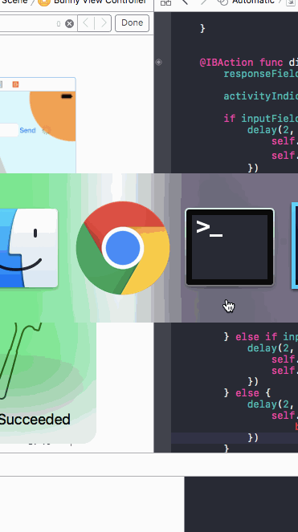

# W2 Lab2: *FurryFriends*

[Instructions](http://courses.codepath.com/courses/ios_for_designers/unit/2#!exercises)

Submitted by: [**Sophia Kecir Camper**](http://www.sophiakc.com)

## Video Walkthrough

## Notes / Challenges encountered while building the app:
Missing:
* [ ] "Wrong password" scenario
* [ ] Dismiss keyboard on 2nd screen

## License

    Copyright [2016] [Sophiakc.com](http://www.sophiakc.com)

    Licensed under the Apache License, Version 2.0 (the "License");
    you may not use this file except in compliance with the License.
    You may obtain a copy of the License at

        http://www.apache.org/licenses/LICENSE-2.0

    Unless required by applicable law or agreed to in writing, software
    distributed under the License is distributed on an "AS IS" BASIS,
    WITHOUT WARRANTIES OR CONDITIONS OF ANY KIND, either express or implied.
    See the License for the specific language governing permissions and
    limitations under the License.